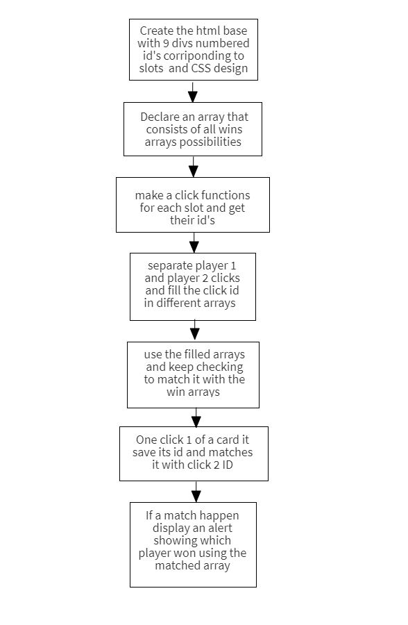

# Project Title

Tic Tac Toe

## Description

It is a 2 player game, each player get either an X or O. The player puts an X or O in a slot inside a 3x3 board that has 9 empty slots. You take turns playing and to win you must be the first player to get a full row, column or diagonal boxes of an X or O.

## Game link - play it here

https://ali-hd.github.io/Project-1-X-O/

### Technical Used

HTML
CSS
JavaScript, and jQuery for DOM manipulation

### Wireframes

### User Stories

As a user I want to choose to play with X or O at the start.
As a user I want to see the intructions.
As a user I want to to choose who I play with.
As a user I dont want allow a play inside a slot that has been filled.
As a user I want to receive an alert when a player wins.
As a user I want to see who's turn it is when playing. 

## Planning and Development Process

First I started to think about how I can tell the code to know which out of the 9 slots the user clicked. I decided to use id names for each slot and when the user click I can retrieve the ID to use later on. Next, I wanted to know when a win has occurred so I made an array that contains all possible wins and used another array for each player to fill and then compare it with the wins array to check if a win has occurred. Using the sort function I was able to match it with other win options despite the order the buttons have been clicked. I didn't want the user to click a slot that has been filled so I made the click do nothing if the current click ID is included in previous player's arrays. 

### Problem-Solving Strategy

I used the console.log() throughout the code, whenever I needed to check the outcome of a variable at a particular time. Also when I find a problem in my code I read the code line by line slowly to see if something doesn't make sense.

### Unsolved problems

One unsolved problem that will be fixed in futrue iteration is the player vs computer mode. A computer will fill slots that has already been filled.

### Favorite functions

My favorite function would be the check for win. It takes both inputs arrays after each play and sorts the move to match it with the known wins.

---

## Acknowledgments

* I would like to thank Misk foundation & General Assembly for giving me the opportunity to take this course.  
* And a special thanks to our instructors Yassir, Ebere, Ahmad and Atheer for helping us along the way.

 ## References

https://developer.mozilla.org/en-US/
https://www.w3schools.com/